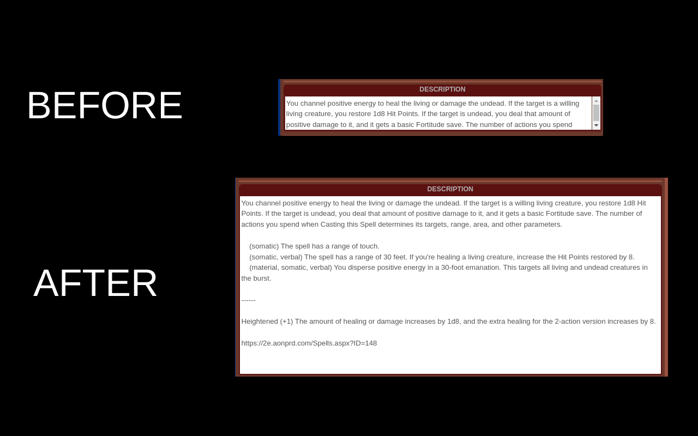

# Roll20 Character Sheet Textarea Expansion Chrome Extension

This makes textareas (feats, spells, etc.) for some Roll20 character sheets larger so you can have an easier time editing.

Character Sheets Tested With:
- Pathfinder 2e
- D&D 5e

Other character sheets might work too, give it a try. :)

## Chrome Web Store Install

Install Link: https://chrome.google.com/webstore/detail/roll20-character-sheet-te/gidankbjdhlnnijiepbefkkanhcnimog

## Manual Install

- Download repo and put somewhere you're not gonna move it.
- Go to chrome://extensions
- Click [Load Unpacked] at the top left of the page.
- Open the folder with the extension in it.
- Enjoy.

## Screenshot

